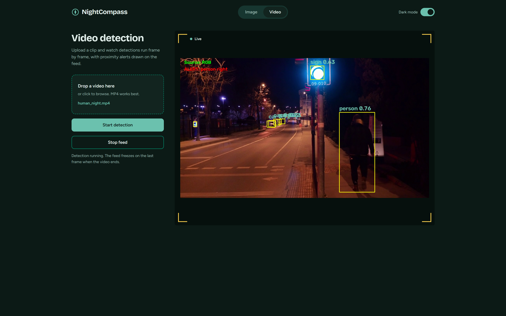
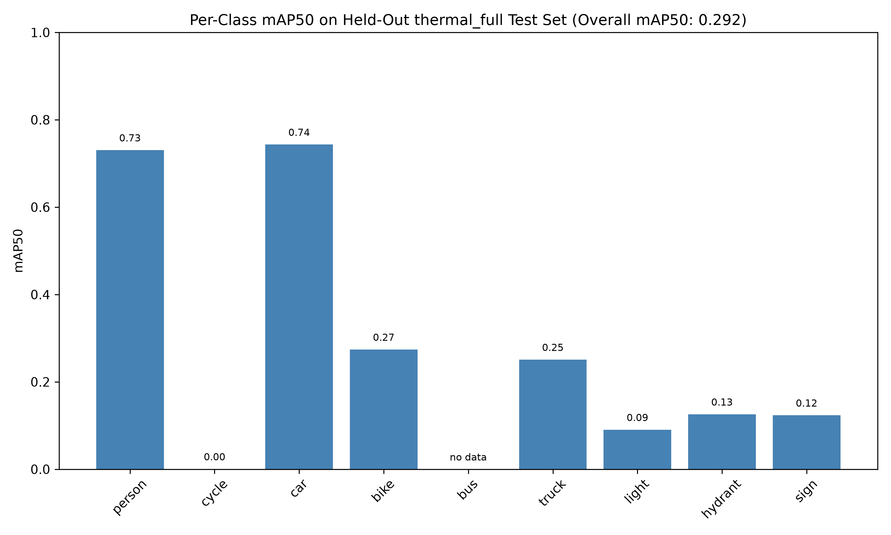
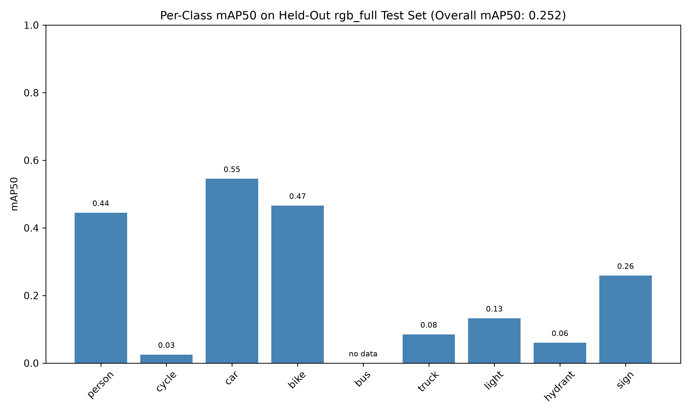

# 🧭 NightCompass

A night-time obstacle detection system for blind pedestrians, built on thermal and RGB imaging with YOLOv8. Two independently trained detectors run on every frame, the more confident one wins, and proximity alerts fire when something gets close.

---

## 📸 Demo


---

## 🌐 Live Demo

👉 **Try it here:**
https://night-compass.onrender.com/

> Hosted on Render's free tier. The first visit after a period of inactivity takes 30 to 60 seconds while the server wakes up. Video detection runs on a shared CPU there, so the live feed is painstakingly slower than on a local GPU; image detection works at normal speed.

---


---

## 🎯 Problem Statement

> Low-light and night-time obstacle detection for blind pedestrians: develop an obstacle detection system that works in low-light conditions using RGB + thermal/infrared imaging and provides real-time alerts.

A white cane handles most static obstacles through contact. What it can't do is warn you about a person, cyclist or vehicle approaching in the dark before it reaches you. NightCompass targets exactly that gap, designed for eventual deployment on spectacle-mounted cameras.

---

## 🚀 Features

- 🌡️ Thermal detector (primary sensor, works in total darkness)
- 🎥 RGB detector (secondary sensor, stronger on texture-heavy objects like signs)
- 🔀 Late fusion via per-frame confidence switching between the two models
- 🚨 Proximity and direction alerts (close / medium / far, left / center / right)
- 🏷️ Low-confidence detections (< 0.3) keep their box but hide the label, cutting noisy misclassifications
- 📐 Resolution-aware annotations that stay readable from 720p to 4K
- ⚡ ~2 ms inference per frame on an RTX 4060
- 🌐 FastAPI backend with live MJPEG video streaming and image detection

---

## 🧠 How It Works

1. A video frame (or single image) comes in
2. Both the thermal and RGB YOLOv8 models run on it
3. Each model's average confidence for that frame is compared, and the stronger model's detections are kept
4. Boxes are drawn on every detection; labels only above 0.3 confidence
5. Alert logic estimates proximity from box height and direction from box position
6. Annotated frame is streamed back, with alerts drawn on it

**Classes (9):** person, cycle, car, bike, bus, truck, light, hydrant, sign

> FLIR's original `bike` (bicycle) and `motor` (motorcycle) were relabelled to `cycle` and `bike` to match Indian usage.

---

## 📦 Dataset

**FLIR ADAS Thermal Dataset v2**, paired thermal and RGB frames with COCO-format annotations.

| Split | Thermal Images | RGB Images |
|---|---|---|
| Train | 10,742 | 10,318 |
| Val | 1,144 | 1,085 |
| Test (video frames) | 3,749 | 3,749 |

**Class selection:** FLIR ships 15+ labelled categories, but several had too few samples to learn from (`dog`: 4, `train`: 5, `deer`: 8, `stroller`: 15, `scooter`: 15, `skateboard`: 29 in thermal train). These were dropped, along with the vague `other vehicle` class, leaving 9 classes with learnable volumes.

---

## 📊 Results

### Thermal model

| Metric | Validation | Held-Out Test |
|---|---|---|
| mAP50 | **0.566** | 0.292 |
| mAP50-95 | 0.337 | 0.158 |
| Person mAP50 | 0.765 | **0.730** |
| Car mAP50 | 0.842 | **0.743** |

### Thermal vs RGB on the held-out test set




| Class | Thermal | RGB |
|---|---|---|
| Person | **0.73** | 0.44 |
| Car | **0.74** | 0.55 |
| Bike | 0.27 | **0.47** |
| Sign | 0.12 | **0.26** |
| Light | 0.09 | **0.13** |
| Overall | **0.292** | 0.252 |

**Key insights:**
- **Person, the most safety-critical class, generalizes well** (0.765 val → 0.73 test), even as weaker classes drop
- **Thermal beats RGB on people and cars**, the heat-emitting classes, which empirically validates thermal as the primary sensor for night use
- **RGB wins on signs and motorcycles**, where printed text, colour and texture matter more than heat
- **Cycles fail on both modalities**: thin wiry frames give poor IoU overlap, riders occlude the bike, and an unpowered metal frame carries almost no heat signature
- `bus` has no instances in the test set, so no test score is reported for it

---

## 🛠️ Tech Stack

- Python, PyTorch
- Ultralytics YOLOv8n (COCO pretrained)
- OpenCV, NumPy, Matplotlib
- FastAPI + Uvicorn
- HTML/CSS/JS (custom UI)

---

## 📁 Project Structure
```
NightCompass/
│
├── configs/
│   ├── thermal.yaml
│   └── rgb.yaml
├── data/                     # FLIR dataset (gitignored)
├── results/
│   ├── thermal_full_test_results_chart.png
│   └── rgb_full_test_results_chart.png
├── static/                   # frontend
├── assets/
│   └── demo.png
├── EDA.py                    # per-class instance counts
├── convert_coco_to_yolo.py   # COCO JSON → YOLO txt labels
├── train.py
├── evaluate.py               # test-set metrics + per-class chart
├── alert_logic.py            # proximity, direction, distance (hardware-gated)
├── run_demo.py               # frame processing + confidence switching
├── main.py                   # evaluate both models, then run demo
├── app.py                    # FastAPI server
├── requirements.txt
└── README.md
```

---

## ⚙️ Model Architecture & Training

- **Base:** YOLOv8n pretrained on COCO (3M parameters, 8.1 GFLOPs)
- **Two separate models:** one on thermal frames, one on RGB frames, same 9-class head
- **Training:** up to 100 epochs, early stopping with `patience=20`, `imgsz=640`, `batch=16`
- **Hardware:** RTX 4060 Laptop GPU (8GB), thermal model converged in 1.8 hours
- **Fusion:** late fusion chosen over early fusion, since it needs no pixel alignment between cameras and degrades gracefully when RGB goes dark

---

## ⚠️ Challenges Faced (and Fixes)

### 1. First Dataset Only Labelled Pedestrians
**Problem:** KAIST Multispectral (39GB) turned out to contain only `person` labels, so no vehicles or street objects

**Fix:** Switched to FLIR ADAS, which covers 15+ classes including lights, signs and hydrants

### 2. "10,742 backgrounds, 0 images" During Training
**Problem:** YOLO found every image but zero labels

**Fix:** Ultralytics locates labels by swapping the literal folder name `images` for `labels`. Folders named `images_thermal_train` broke that swap, so the data was restructured to `thermal/images/train` and `thermal/labels/train`

### 3. Windows Crashes Before Training Started
**Problem:** Multiprocessing `RuntimeError` on one machine, `WinError 1455` (page file too small) and CUDA out-of-memory on a 6GB GPU on the other

**Fix:** Wrapped training in `if __name__ == "__main__":`, enlarged Windows virtual memory, and dropped batch size to 8 on the smaller GPU

### 4. Per-Class Chart Shape Mismatch on the Test Set
**Problem:** The test split has no `bus` instances, so YOLO returned 8 AP values instead of 9 and the chart crashed

**Fix:** Mapped scores through `results.ap_class_index` and marked absent classes as "no data" instead of a misleading 0

### 5. Reflective Safety Vests Detected as Lights
**Problem:** People in fluorescent clothing were labelled `light`, always with confidence below 0.3

**Fix:** Boxes still draw for every detection, but labels only show at 0.3 confidence and above

### 6. Unreadable Annotations on 4K Video
**Problem:** OpenCV draws text in fixed pixels, so labels shrank to nothing on high-resolution clips

**Fix:** Font size and line thickness now scale with frame height, using 720p as the reference

---

## 🧭 Project Workflow

1. **Problem scoping**: thermal chosen over near-infrared, since NIR needs an active illuminator that won't fit on spectacles
2. **Dataset**: KAIST evaluated and dropped, FLIR ADAS adopted
3. **EDA**: per-class instance counts to decide which classes are learnable
4. **Conversion**: COCO JSON to YOLO txt labels, normalized coordinates, class remapping
5. **Smoke tests**: 5-epoch runs on both modalities to validate the pipeline end to end
6. **Full training**: thermal and RGB models with early stopping
7. **Evaluation**: validation metrics, then held-out test set with per-class charts
8. **Alert logic**: proximity and direction from box geometry
9. **Demo**: frame-by-frame video inference with confidence switching
10. **API + UI**: FastAPI server with live MJPEG streaming and image detection

---

## 🔭 Limitations & Future Work

- **Static obstacles:** poles, curbs and walls sit near ambient temperature and are hard to see thermally. A depth camera or ultrasonic sensor would cover this
- **Metric distance:** a pinhole-camera distance estimator is already written in `alert_logic.py`, disabled until the real camera's focal length is available
- **Animals:** stray dogs are a real hazard on Indian streets, but FLIR has only 4 dog samples. A dedicated animal dataset is needed
- **True sensor fusion:** synchronized thermal + RGB camera pairs would allow proper box-level fusion instead of per-frame switching
- **Edge deployment:** TensorRT export for a wearable compute module, with audio or haptic alerts instead of on-screen text

---

## 💡 Key Takeaway

```bash
Sensor Choice → Dataset Curation → Transfer Learning → Honest Evaluation → Real-Time Alerts
```

---

## 💡 Final Note
This project demonstrates:

- Object Detection (YOLOv8, transfer learning, multi-modal training)
- Data Engineering (COCO to YOLO conversion, class curation, dataset restructuring)
- Model Evaluation (held-out testing, per-class analysis, modality comparison)
- Applied Reasoning (sensor physics driving design decisions)
- Backend Engineering (FastAPI, live video streaming)
- Frontend Development

---

**Built by Ashish Mishra and Soumik Das**